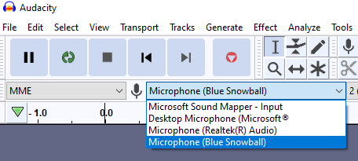
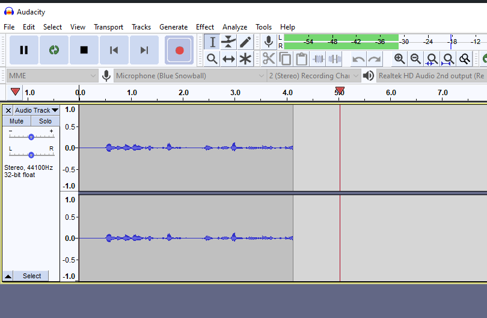
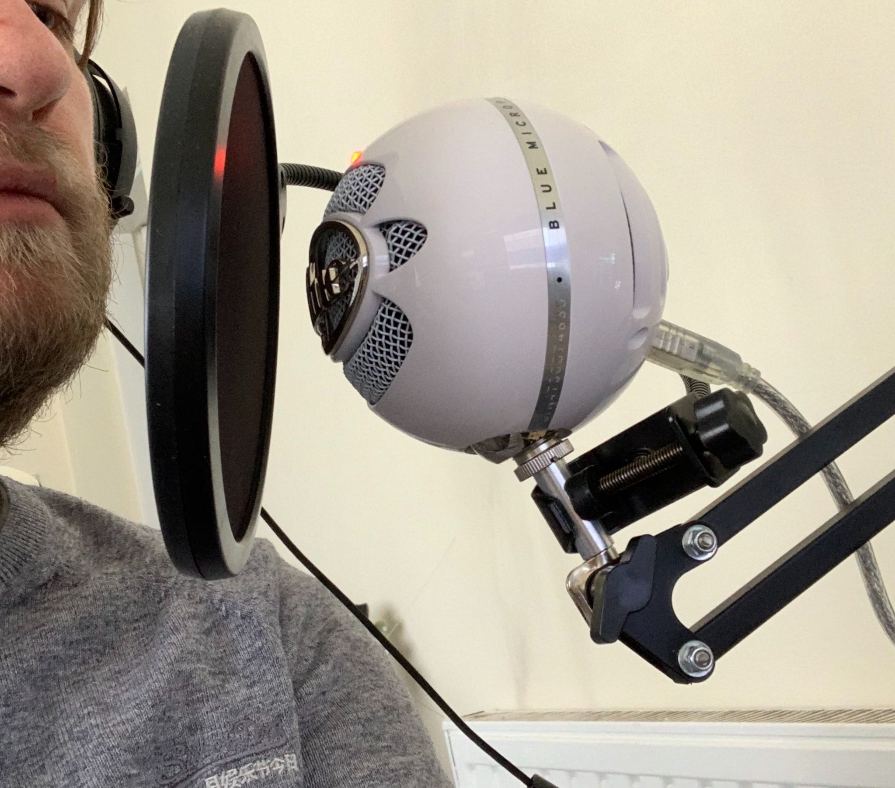
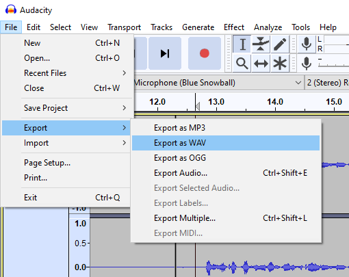
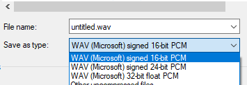

## Pre-requisites

First of all, you're going to need to download and install Audacity.

* [Windows installer](https://www.fosshub.com/Audacity.html?dwl=audacity-win-2.3.3.exe)
* [Mac installer](https://www.fosshub.com/Audacity.html?dwl=audacity-macos-2.3.3.dmg)

## Setup Audacity For Recording

### Ensure your microphone is selected

Select the microphone you're going to record with from the input drop-down in Audacity.

### Do a test recording

Hit the red record button and say a few sentences into the microphone to test you're configured and ready to go. Press the stop (the square) button when you want to stop recording.

Use this to test the positioning of your microphone. 

In the above example, playing back sounded like I was too far away.

Adjust the distance and repeate recording and playback until you sound clear and "close".

### You're good to go!

Once you're happy with it, you're good to go. When we're all ready, a countdown will begin and when we hit zero, hit that record button!

Be sure to record a few seconds of silence at the beginning for post-processing so we can work out noise profiles to do noise reduction after recording!

## Saving the audio

For best quality, saving as an uncompressed format is ideal.

We save it as a **WAV**. To do this in Audacity go to **File > Export > Export a WAV**.

Rename the file as **yourname.wav** and save it as **WAV (Microsoft) signed 16-bit PCM**.

Then send it over Slack to Jonathan.
